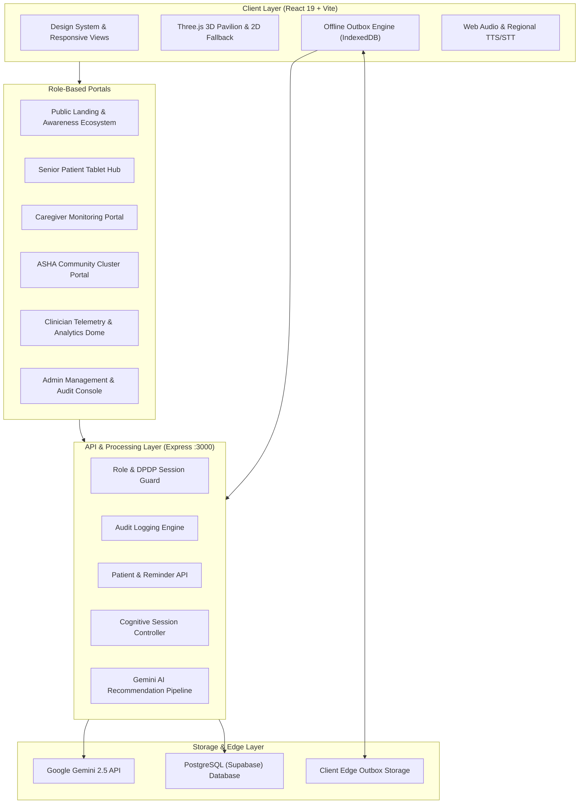

# MementoCare AI — Product & Technical Architecture

## 1. Executive Product Overview
MementoCare AI (*MindCare NER Ecosystem*) is an offline-first, culturally grounded, and voice-enabled cognitive engagement, daily routine assistance, and caregiver telemetry platform tailored for elderly seniors with mild cognitive impairment (MCI) and early-stage dementia across the 8 North-Eastern states of India.

---

## 2. Core Pillars & Principles
1. **Culture & Personhood First**: Grounded in familiar regional contexts, languages (Assamese, Bengali, Manipuri, Mizo, Khasi, Hindi, English), and verified personal family memories.
2. **Offline-First Resilience**: Local SQLite / IndexedDB outbox queue ensuring uninterrupted cognitive continuity even in remote hill districts with 0% cellular connectivity.
3. **Statutory Medical Safety Boundaries**: Strict non-diagnostic, non-prescriptive posture. Empowers caregivers and clinicians with longitudinal engagement telemetry without diagnosing pathology or recommending medication changes.
4. **Universal Accessibility (WCAG 2.2 AA)**: 6 dedicated modes (Standard, Large Text, High Contrast, Voice-First, Reduced Motion, Low Literacy) with 3px focus rings and 48px+ tap targets.

---

## 3. System Architecture Diagram

---

## 4. Multi-Role Workspaces & Information Architecture

### 1. Public Landing & Awareness Ecosystem (`AWARENESS`)
- **Interactive 3D Pavilion**: Dynamic Three.js memory node visualization with fallback.
- **30 Deep-Dive Product Modules**: Explaining cultural memory graphs, dialect engine, edge synchronization, and clinical telemetries.
- **Regional Dialect Audio Soundboard**: Sample phrases in 7 North-East languages.
- **Device Viewport Sandbox**: Desktop, Tablet, and Mobile preview simulator.
- **Playable Mini-Games**: Assam Tea Leaf sorting and Bamboo Rhythm recall.

### 2. Senior Patient Tablet Hub (`PATIENT`)
- **Home Hub**: Contextual time-of-day greeting, voice assistant trigger, one-tap activity buttons.
- **8 Cognitive & Reminiscence Games**: Tea Garden Recall, Familiar Sounds of NE India, Bamboo Rhythm Pattern, Memory Match, Daily Living Sequence, Object Recognition, Odd One Out, Personal Memory Album.
- **Daily Schedule & Meds**: Visual and audible pill & hydration reminders with adherence tracking.
- **Family Connect**: Multi-generational voice notes and annotated photo albums.
- **Peaceful Music & Ambient Therapy**: Regional folk instruments and nature soundscapes.

### 3. Caregiver Remote Monitoring Portal (`CAREGIVER`)
- Longitudinal cognitive engagement trajectory charts.
- Hydration and medication adherence tracking.
- Urgency alert notifications and one-tap ASHA / Clinician escalation.

### 4. ASHA / Community Health Worker Portal (`ASHA`)
- Village cluster patient roster with triaging priority indicators.
- Offline visit notes and bluetooth sync export.

### 5. Clinician Analytics Dome (`HEALTHCARE_WORKER`)
- Multi-domain cognitive response time analytics.
- Exportable clinical summary with statutory non-diagnostic disclaimers.

### 6. Admin Management & Audit Console (`ADMIN`)
- Cultural asset catalog editor.
- Dialect audio bank verifier.
- Real-time system telemetry and immutable audit logs.
